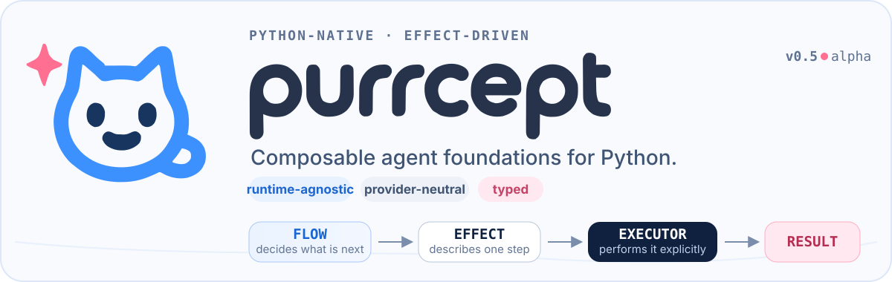
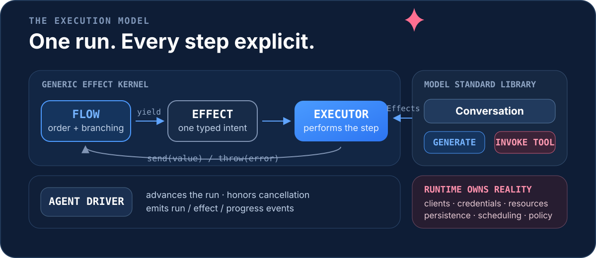

<p align="center">
  <a href="./README.md">English</a> · <strong>简体中文</strong>
</p>

<p align="center">
  
</p>

<p align="center">
  <a href="./CHANGELOG.md"></a>
  <a href="./pyproject.toml"></a>
  <a href="./src/purrcept_core/py.typed"></a>
  <a href="./pyproject.toml"></a>
</p>

<p align="center">
  <a href="#为什么选择-purrcept">为什么选择 Purrcept</a> ·
  <a href="#快速开始">快速开始</a> ·
  <a href="#加入模型层">模型层</a> ·
  <a href="#选择所需边界">边界</a> ·
  <a href="#文档">文档</a>
</p>

Purrcept Core 是一个 Python 原生、Effect 驱动的可组合 Agent 基础。普通 Generator Flow
决定下一步，类型化 `Effect` 描述一次操作，`Executor` 执行它，`AgentDriver` 推进整个
Run。

可选的 `purrcept_core.models` 标准库进一步提供 Provider 无关的对话、Prompt、函数工具、
流式事件、上下文策略与 Backend 一致性测试；Provider client、凭据、持久化和应用 Runtime
的所有权仍然留在 Core 之外。

> [!IMPORTANT]
> `0.5.1` 是 alpha 版本。默认开发路径已经形成，但在 `1.0` 前仍可能根据真实 Provider
> 与 Runtime 的集成反馈进行小范围 API 调整。

## 执行模型

<p align="center">
  
</p>

每个 yield 出的操作都通过同一个执行边界。因此，取消、Middleware、进度、生命周期事件、
重试、审批与测试都能精确作用于当前步骤。模型工具循环也不会绕过这个模型：一次
`conversation.ask()` 可以产生 `Generate → InvokeTool → Generate`，其中每次模型生成和
工具调用仍然是独立 Effect。

## 为什么选择 Purrcept

- **使用普通 Python 组合。** 直接使用 Generator、`yield from`、条件、循环、嵌套 Flow、
  返回值与普通异常处理。
- **观察每个副作用。** Run / Effect 标识、step index、进度、成功、失败和取消都经过同一套
  Driver 生命周期。
- **把现实资源留在边缘。** Runtime 拥有 Provider client、凭据、数据库、调度、持久化与
  平台策略。
- **切换 Provider，不改变 Agent 语义。** 模型层定义不可变消息、请求、响应、工具、流事件、
  缓存意图与错误分类。
- **通过显式组合扩展。** 扩展是普通 Python 包与显式传入的对象；安装或导入不会自动启用
  能力。

## 快速开始

Purrcept Core 当前从源码开发。在仓库目录执行：

```bash
pip install -e .
```

也可以安装完整贡献者环境并运行第一个离线示例：

```bash
uv sync --all-groups
uv run python examples/01_inline_effect.py
```

定义一个类型化 Effect，在 Flow 中组合，然后交给 Driver 运行：

```python
import asyncio
from dataclasses import dataclass

from purrcept_core import (
    AgentDriver,
    AgentFlow,
    Effect,
    ExecutionContext,
    InlineExecutor,
    perform,
)


@dataclass(frozen=True, slots=True)
class Add(Effect[int]):
    left: int
    right: int

    def execute(self, context: ExecutionContext[None]) -> int:
        return self.left + self.right


def calculate() -> AgentFlow[int]:
    first = yield from perform(Add(1, 2))
    return (yield from perform(Add(first, 4)))


async def main() -> None:
    result = await AgentDriver(InlineExecutor()).run(calculate(), host=None)
    print(result)


asyncio.run(main())
```

```text
7
```

`perform()` 会保留 `Effect[T]` 的结果类型。事件循环归 Runtime 所有；Core 内部从不调用
`asyncio.run()`。

## 加入模型层

把 Runtime 拥有的 Backend 绑定到模型，再让 `Conversation` 运行可观察的工具循环：

```python
from purrcept_core import AgentFlow
from purrcept_core.models import Model, tool


@tool
async def search(query: str) -> list[str]:
    """搜索受信任的应用数据源。"""

    return [f"关于 {query} 的结果"]


def researcher(model: Model, question: str) -> AgentFlow[str]:
    conversation = model.conversation(
        instructions="请区分已验证事实与推测。",
        tools=(search,),
        cache="auto",
    )
    result = yield from conversation.ask(question)
    return result.text
```

具体 `ModelBackend` 来自 Provider 包。它接收不可变、Provider 无关的请求，再映射到对应
SDK 或传输协议。Core 提供确定性的
[Backend Conformance Kit](./docs/models.md#provider-conformance-kit)，让适配器无需真实网络
请求就能验证请求语义、流式顺序、错误、取消、工具事务与 Reminder 移除。

独立开发的 [`purrcept_litellm`](https://github.com/purrcept/purrcept_litellm) 是一个面向
LiteLLM Chat Completions 的具体适配器。

## 选择所需边界

| 层 | 所有权 | 适用场景 |
| --- | --- | --- |
| Effect 内核 | `Flow`、`Effect`、`Executor`、`AgentDriver` | 操作需要显式编排、观察或策略控制。 |
| 模型标准库 | `Model`、`Conversation`、Prompt、工具、上下文、模型事件 | Agent 需要 Provider 无关的模型与工具语义。 |
| Provider 包 | `ModelBackend`、SDK 映射、传输错误 | 具体模型服务需要实现 Core 协议。 |
| Runtime / 应用 | Client、凭据、host 资源、持久化、调度 | 现实资源与产品策略需要被拥有和强制执行。 |

### Core 有意不负责

Core 不创建事件循环、后台任务、Provider client、数据库连接或进程级单例，也不提供平台
会话、Memory/RAG、任务调度、Durable Execution、HTTP/CLI 服务、全局工具注册表、隐藏重试
或隐藏 Fallback。

Effect 与 handler 是普通的进程内 Python 代码。统一执行边界让它们可观察、可包装，但不构成
沙箱或权限边界。Runtime 必须强制执行授权，并决定哪些输入、输出与错误可以被记录。

## 模型能力概览

- 不可变的 Message、Content、Request、Response、Usage、Continuation 与流事件值。
- `PromptTemplate`、可组合 Render Policy、局部 `PromptLibrary` 与确定性
  `PromptCompiler`。
- 事务化 `Conversation` turn、snapshot、restore、fork、分 scope Reminder、动态
  `ReminderSource`、Prompt trace 与完整请求 token 预算。
- 类型化 Python 函数工具、自动 JSON Schema、参数验证、结果编码与显式错误策略。
- Append-only、Sliding-window 与注入式 Token-budget 上下文策略。
- Provider 无关的缓存意图、Continuation 策略、结构化模型错误与离线 Backend 一致性套件。

完整契约与示例见[模型标准能力](./docs/models.md)。

## 文档

**从这里开始**

- [核心概念](./docs/concepts.md)
- [Effect 与 Flow](./docs/effects.md)
- [模型标准能力](./docs/models.md)
- [Core / Runtime 边界](./docs/runtime-boundary.md)

**构建与扩展**

- [Executor](./docs/executors.md)
- [生命周期事件](./docs/events.md)
- [Middleware](./docs/middleware.md)
- [测试辅助能力](./docs/testing.md)
- [扩展包](./docs/extension-packages.md)

<details>
<summary><strong>参考、兼容性与架构决策</strong></summary>

- [公共 API 参考](./docs/api.md)
- [兼容性与迁移](./docs/compatibility.md)
- [变更日志](./CHANGELOG.md)
- [架构决策记录](./adr/)
- [Core 边界 ADR](./adr/0001-core-boundary.md)
- [模型标准库 ADR](./adr/0006-model-standard-library.md)
- [Prompt Control State ADR](./adr/0007-prompt-control-state.md)

</details>

## 开发

Purrcept Core 支持 Python `3.11` 至 `3.14`，发布 `py.typed`，使用 Pyright 严格模式，并将
100% 分支覆盖率设为门禁。

```bash
uv sync --all-groups
uv run ruff check .
uv run ruff format --check .
uv run pyright
uv run pytest --cov=purrcept_core --cov-report=term-missing
uv build
```

修改公共契约前请阅读 [CONTRIBUTING.md](./CONTRIBUTING.md)。新增行为应同时包含聚焦测试和
对应的叙事性文档。

## 项目状态

- 当前版本：`0.5.1` alpha。
- 支持的 Python 版本：`3.11`、`3.12`、`3.13` 与 `3.14`。
- Runtime 依赖：Pydantic v2，仅在函数工具内部使用，不进入公共模型协议。
- 已在 PyPI 发布为 `purrcept_core`；自动发布流程见 [Releasing](RELEASING.md)。
